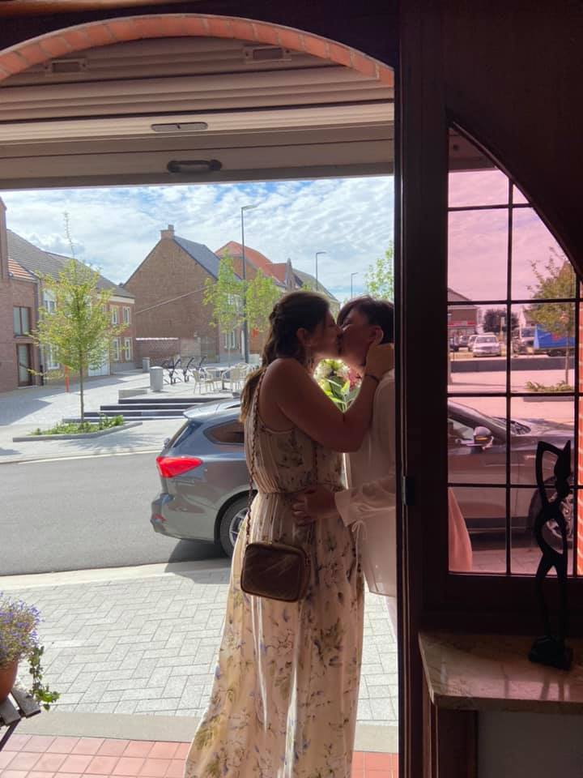

Hello there!

I am Kelly Crabbé, an almost 40 year old DevOps Engineer. Although I freely admit that I am merely a junior DevOps; I recently switched over from the System Administrator side, which has been my job for over 10 years. 

I had been working for [MS Amlin](https://msamlin.com) for the better part of my professional life until about a year and a half ago. Then I wanted to explored some other sceneries, and swapped my System Administrator gig for a DevOps Engineer gig at [Lineas NV](https://lineas.net). 

On August 13th 2021; I got married to the love of my life, the mother of my plus daughter; Ziggy. She was named after Ziggy Stardust, for those who are wondering. We got married in the garden of her mother and stepfather. It was a wonderfully intimate ceremony amidst the corona rules.

In October 2020, we adopted our furry son, Lou. He's an English Cocker Spaniel with a few peculiarities. He had something resembling ADHD for dogs, as a pup he'd only sleep about 5 to 6hrs a day while puppies need at least 20 hours the few weeks. He just barely slept or rested up, which lead to a dog completely overstimulated, overexcited and very orally oriented (aka he even bit grooves into the metal part of my desk chair). So we worked very hard and very intensely with him, and now he still has some issues to work on, but he now sleeps like a baby. 

We, as a family, have learned to read our dog, and we do arrange our days based on his needs. We pay attention to his window of tolerance and his stress bucket. Occasionally, we kind of misfire, but mostly we can manage his needs and we have a wonderful fur baby who colors every single day. 

